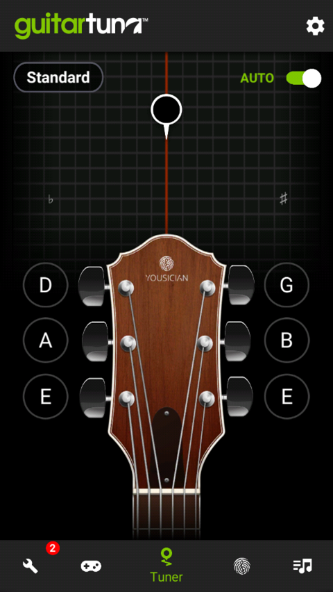
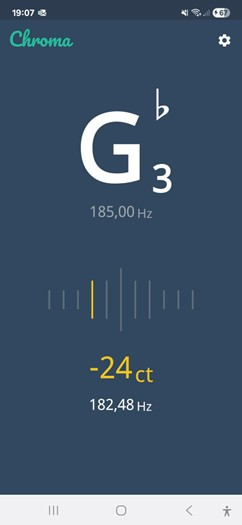
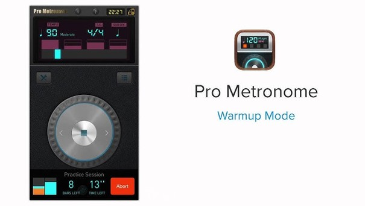
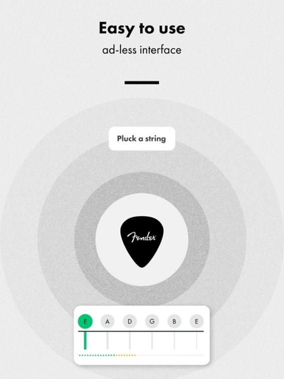
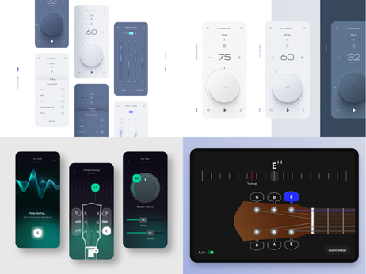

# GuitarWatch

## 📁 Présentation des Principaux Dossiers

> Une présentation des principaux dossiers de votre dépôt. Quelles sont les différentes ressources qu'il contient à la racine ? Par exemple, les maquettes, vos inspirations, etc. Si vous avez fait des efforts quant à l'organisation de vos fichiers dans le dossier `lib`, expliquez-les ici.

## 🚀 Présentation de l'Application

GuitarWatch s'adresse à tous les passionnés de guitare, qu'ils soient débutants ou expérimentés. L'application vise à offrir une expérience immersive en permettant aux utilisateurs de suivre et d'améliorer leur pratique de la guitare à travers des fonctionnalités interactives et personnalisées.
Avec GuitarWatch, vous pouvez: 
- Accorder votre guitare facilement grâce à un accordeur intégré.
- Jouer en rythme avec un métronome personnalisable.
- Explorer une listes d'accords à apprendre et à pratiquer.
- Ajouter vos propres partitions et tablatures.
De plus, une notification quotidienne vous rappelle de pratiquer, vous aidant ainsi à rester motivé et à progresser régulièrement.

## 🌐 Étude de l'Existant
 
### Guitar Tuna
Guitar Tuna est une application populaire pour accorder les guitares. Elle offre une interface conviviale et des fonctionnalités supplémentaires telles que des jeux d'accords et des exercices de rythme.
#### Points forts:
- Interface simple, rapide et précise, adaptée à plusieurs instruments (guitare, basse, ukulélé ...)
- Idéale pour les débutants grâce aux outils supplémentaires payant (accords, tablatures, leçon).
- Bonne précision de l'accordage.
#### Points faibles:
- Version gratuite souvent envahie par la publicité et les incitations à passer à la version payante.
- Moins précise que les tuners matériels dans des environnemnents bruyants ou scéniques.

### Chroma git hub -open source
Chroma est une application open source disponible sur GitHub qui offre des fonctionnalités d'accordage pour les guitares et autres instruments à cordes.
#### Points forts:
- Application open-source sous licence MIT - grande flexibilité pour les modifications.
- Idéal pour les développeurs souhaitant étudier ou adapter une application de tuning.
- Interface simple et utilisable pour n'importe quel instrument à cordes.
- Fonctionnalité de suppression de bruit
- Paramétrage avancé de la précision ainsi que le choix d'algorithme de détection de note.
#### Points faibles:
- Abscence de version prête à l'emploi ou support utilisateur grand public.
- Plus développé.
- C'était publié auparavant sur le play Store mais plus maintenant.

### Pro Metronome 
Pro Metronome est une application de métronome avancée qui offre une variété de fonctionnalités pour les musiciens de tous niveaux.
#### Points forts:
- Métronome modulable, très précis.
- Interface utilisateur intuitive, pas de publicités en version de base 
- Modes visuels, haptiques, flash (pratique en contexte musical bruyant) et outils pédagigiques comme le Rhythm Trainer.
- #### Points faibles:
- Certaines fonctionnalités avancées nécessitent un abonnement payant.

### Fender Tune
Fender Tune est une application d'accordage développée par la célèbre marque Fender, offrant des fonctionnalités pour accorder les guitares et autres instruments à cordes.
#### Points forts:
- Application gratuite sans publicité.
- Mode Auto-Tune, chromatique et multiples tunings disponibles.
- Bibiliothèque d'accords et de gammes intéractive, pistes de batterie et outils d'apprentissage (Via Tune plus).
#### Points faibles:
- Le tuning automatique peut manquer de fiabilité.
- Problèmes pour enregistrer des tunings personnalisés ou accéder à certaines fonctionnalités.

## Moodboard 

## 🎯 Public Cible

Notre application s'adresse à tous les passionnés de guitare, qu'ils soient débutants ou experts.
Les outils proposés par GuitarWatch sont conçus pour accompagner l'apprentissage et permettre le perfectionnement des compétences de chaque utilisateur.

## 📋 Fonctionnalités
En tant qu'utilisateur, je dois pouvoir accorder ma guitare facilement avec l'application.

En tant qu'utilisateur, je dois pouvoir choisir mon type d'accordage.

En tant qu'utilisateur, je dois pouvoir choisir mon instrument à accorder.

En tant qu'utilisateur, je dois pouvoir utiliser un métronome pour m'aider à garder le rythme.

En tant qu'utilisateur, je dois pouvoir changer les BPM de mon métronome.

En tant qu'utilisateur, je dois pouvoir modifier la signature temporelle.

En tant qu'utilisateur, je dois pouvoir avoir accès aux accords de base de mon apprentissage.

En tant qu'utilisateur, je dois pouvoir ajouter des tablatures et des accords supplémentaires

En tant qu'utilisateur, je dois pouvoir recevoir une notification quotidienne me rappelant de pratiquer la guitare.

En tant qu'utilisateur, je dois pouvoir personnaliser l'heure de la notification quotidienne.

En tant qu'utilisateur, je dois avoir une application qui s'adapte aussi bien au mode jour qu'au mode nuit de mon téléphone.

En tant qu'utilisateur, je dois pouvoir m'enregistrer sur mon application.

En tant qu'utilisateur, je dois avoir accès à mes partitions via le compte ainsi qu'aux paramètres.

En tant qu'utilisateur, je dois pouvoir sauvegarder via mon compte le type d'accordage.

En tant que développeur, je souhaite donner aux utilisateurs des badges pour qu'il passe plus de temps sur l'application.

## 📈 État d'Avancement

- [ ] Ecran de connexion
- [ ] Ecran d'accordage 
- [x] Ecran de métronome
- [x] Ecran d'accords
- [ ] Ecran de paramètres
- [ ] Persistance des données
- [ ] Notifications
- [ ] Système de badges
- [ ] Changement d'instrument 
- [ ] Paramétrage de l'accordage
- [ ] configuration de la signature temporelle
- [ ] Gamification 

## ⚙️ Compilation de l'Application

> Enfin, nous vous demandons d'ajouter une section pour les développeurs où vous expliquez ce qu'il faut faire pour pouvoir compiler l'application. Cette documentation doit être simple et surtout efficace.

<!-- vim: set spelllang=fr :-->